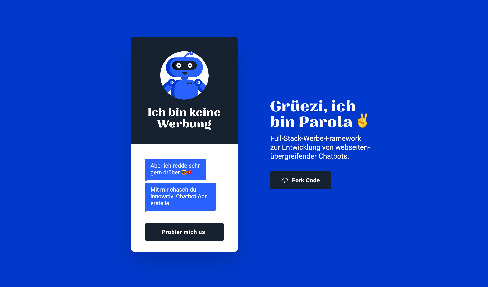
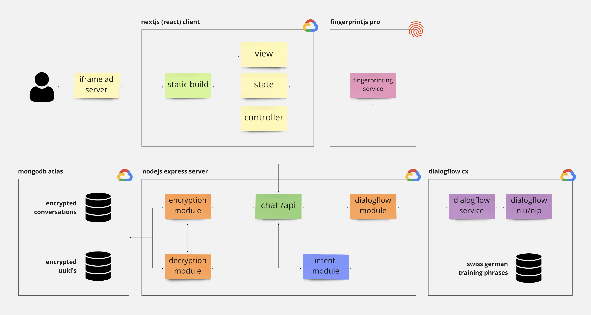

# Parola Chat

## About

**Parola is a full-stack advertisement framework** to develop encrypted cross-website conversational experiences with Swiss German natural language understanding/processing.

Its goal is to engage and encourage users throughout the whole customer journey, from the first touchpoint up to a purchase and beyond — all without the need for cookies and without violating user privacy. Advertisers benefit from an innovative and playful display ad that certainly separates itself from conventional display ads.

## Explanation

The Parola software is a full-stack micro-service NextJS/MERN application. I mainly used TypeScript throughout the whole project. The database of choice is MongoDB (DaaS is [MongoDB Atlas](https://www.mongodb.com/cloud/atlas)), and as the NLP framework, I used Google Cloud Platform's [DialogFlow CX API](https://cloud.google.com/dialogflow/cx/docs). Keep in mind that I utilised a paid server-side fingerprinting service called [FingerprintJS Pro](https://fingerprintjs.com) for the cookie-less authentication. I highly recommend running Parola on an IaaS provider since it needs to be scalable and able to handle high traffic.

## Architecture

The software splits up into different first-party and third-party services. In the end, one's ad server of choice will deliver the application's NextJS build inside an iFrame.

- **The client** requests a UUID from the third-party fingerprinting service. This UUID will be sent to the Express server.
- **The Express server** gets all the requests through a REST-ish API and acts as the proxy between the DialogFlow CX service and the MongoDB database. Every request needs the UUID from the fingerprinting service for an authentication. The Express server is hosted on an app engine on the Google Cloud Platform.
- **The MongoDB database** is also hosted on the Google Cloud Platform and stores the encrypted UUIDs and the encrypted conversations.
- **The DialogFlow CX API** is being called from the Express server and returns the replies from the corresponding agent as well as the intent information that is needed for the intent module.
- **The intent module** is a module that sends particular message types (like videos, images and product sliders) to the client. It's triggered through pre-defined intent keywords from the DialogFlow CX API.

## Documentation

Before you can create a Parola chatbot ad on your own, be sure to have these prerequisites on your computer:

- NodeJS `node ≥12`
- Google Cloud Platform SDK `gcloud ≥328.0.0`
- TypeScript compiler `tsc ≥3.9.7`
- Git `git ≥2.22.0`
- Yarn `yarn ≥1.22.10`

**Use one of the following documentations:**

- [How to use the Parola API](doc/how-to-parola-api.md)
- [How to set up and develop locally](doc/how-to-develop-locally.md)
- [How to create and deploy a new chatbot ad](doc/how-to-new-ad.md)

## Next Steps

This project was created in the final weeks while working at the Mediakanzlei AG in Switzerland. I finished an MVP-release that covers all the necessary functionalities for a demo-run. Nonetheless, there are many ideas as well as pain points to consider regarding Parola. Please see the attached files for further information:

- [Ideas and features](doc/ideas-features.md)
- [Pain points](doc/pain-points.md)

## License

This project is licensed under the [GNU General Public License v3.0](https://www.gnu.org/licenses/gpl-3.0.en.html). See the [LICENSE](LICENSE) file for more information. For further or unanswered questions, please refer to my email: [public@danielburger.online](mailto:public@danielburger.online).
