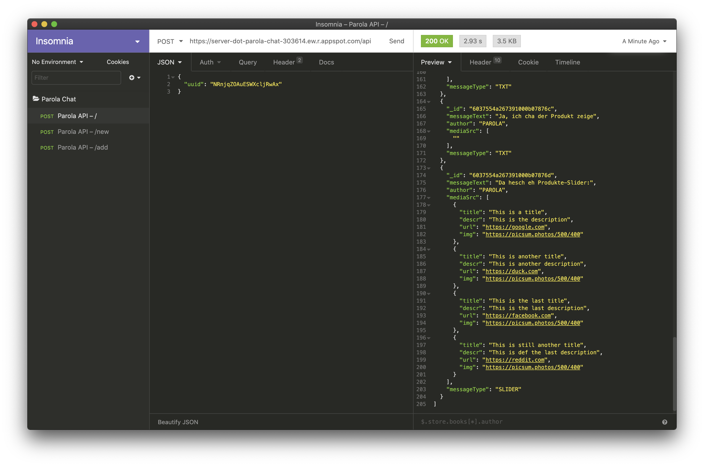

# How to use the Parola API

I highly recommend using a desktop API client for testing the Parola API on your machine. My personal favourite is [Insomnia](https://insomnia.rest).



## API endpoints and requests

### /api

`POST REQUEST`

```JSON
{
   "uuid": "NRnjqZOAuESWXcljRwAx"
}
```

`200 RETURN`

```JSON
[
  {
    "_id": "603754b9267391000b07875a",
    "messageText": "This is an example text reply from Parola.",
    "author": "PAROLA",
    "mediaSrc": [""],
    "messageType": "TXT"
  },
  {
    "_id": "603754df267391000b07875d",
    "messageText": "This is an example message from the user.",
    "author": "USER",
    "mediaSrc": [""],
    "messageType": "TXT"
  },
  {
    "_id": "6037552f267391000b078767",
    "messageText": "This is an image reply from Parola:",
    "author": "PAROLA",
    "mediaSrc": ["https://picsum.photos/500/450"],
    "messageType": "IMAGE"
  },
  {
    "_id": "6037553b267391000b07876a",
    "messageText": "This is a video reply from Parola:",
    "author": "PAROLA",
    "mediaSrc": ["https://www.youtube.com/embed/aqz-KE-bpKQ"],
    "messageType": "VIDEO"
  },
  {
    "_id": "6037554a267391000b07876d",
    "messageText": "This is a slider reply from Parola:",
    "author": "PAROLA",
    "mediaSrc": [
      {
        "title": "This is a title",
        "descr": "This is a description",
        "url": "https://google.com",
        "img": "https://picsum.photos/500/400"
      },
      {
        "title": "This is another title",
        "descr": "This is another description",
        "url": "https://youtube.com",
        "img": "https://picsum.photos/500/400"
      },
      {
        "title": "This is the last title",
        "descr": "This is the last description",
        "url": "https://facebook.com",
        "img": "https://picsum.photos/500/400"
      }
    ],
    "messageType": "SLIDER"
  }
]
```

---

### /api/new

`POST REQUEST`

```JSON
{
  "uuid": "NRnjqZOAuESWXcljRwAx",
  "conversations": [
    {
      "messageText": "This is an initial message",
      "author": "PAROLA",
      "messageType": "TXT"
    },
    {
      "messageText": "This is another initial message",
      "author": "USER",
      "messageType": "TXT"
    }
  ]
}
```

`200 RETURN`

```JSON
[]
```

---

### /api/add

`POST REQUEST`

```JSON
{
  "uuid": "NRnjqZOAuESWXcljRwAx",
  "conversations": [
    {
      "messageText": "This is new message from the user",
      "author": "USER",
      "messageType": "TXT"
    }
  ]
}
```

`200 RETURN`

```JSON
[
  {
    "_id": "60376402e82c26000af2c691",
    "messageText": "This is the reply from DialogFlow",
    "author": "PAROLA",
    "mediaSrc": [""],
    "messageType": "TXT"
  },
  {
    "_id": "60376402e82c26000af2c692",
    "messageText": "This is another reply from DialogFlow",
    "author": "PAROLA",
    "mediaSrc": ["https://picsum.photos/500/450"],
    "messageType": "IMAGE"
  }
]
```
